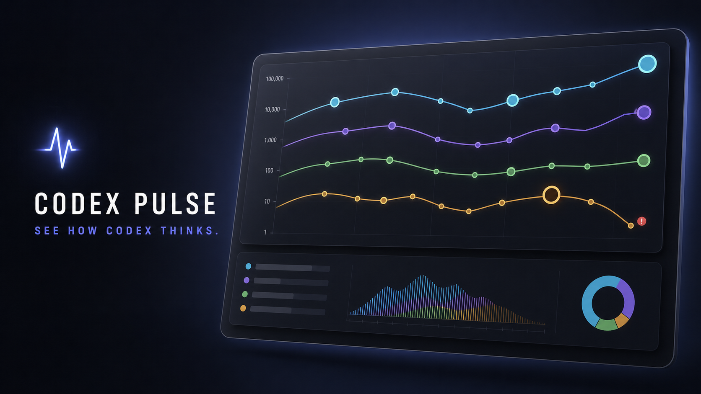

# Codex Pulse



<p align="center">
  <strong>See how Codex thinks.</strong><br>
  A native macOS reasoning monitor for every active Codex thread.
</p>

<p align="center">
  <a href="https://github.com/soundadam/codex-pulse/releases/latest"></a>
  <a href="https://github.com/soundadam/codex-pulse/actions/workflows/ci.yml"></a>
  <a href="LICENSE"></a>
  
  
</p>

Codex Pulse turns local Codex telemetry into a compact, real-time map of reasoning behavior. Each Thread gets a stable color and each Turn becomes a node: vertical position is total reasoning tokens, node area is total token volume, and small status accents flag invalid, unknown, or running work without hiding Thread identity.

The entire monitor lives in the macOS menu bar. It stays quiet in the background, opens instantly, and keeps all rollout and token data on your Mac.

## Install with Homebrew

```bash
brew install --cask soundadam/tap/codex-pulse
xattr -dr com.apple.quarantine "/Applications/Codex Pulse.app"
open -a "Codex Pulse"
```

The current build is hardened-runtime, ad-hoc signed, and universal for Apple Silicon and Intel Macs. It is not yet Apple-notarized, so Homebrew verifies the release checksum first and the explicit `xattr` step removes quarantine before first launch. See [Release and signing](docs/release.md) for the trust boundary and the future notarization path.

You can also download `Codex-Pulse-1.0.1-macOS-universal.zip` from the [latest release](https://github.com/soundadam/codex-pulse/releases/latest), move the app to `/Applications`, and remove quarantine before first launch:

```bash
xattr -dr com.apple.quarantine "/Applications/Codex Pulse.app"
open "/Applications/Codex Pulse.app"
```

## What you can see

- **Turn reasoning at a glance.** The logarithmic Y axis shows reasoning tokens across many orders of magnitude without flattening small Turns.
- **Thread-specific behavior.** Turns are connected only within their own Thread; different Threads are never joined by an artificial global line.
- **Total workload.** Node area encodes total tokens, making unusually large Turns visible before opening details.
- **Precise status signals.** Invalid adds a small red badge, Unknown adds a gray badge, and Running adds an orange ring. The Thread color remains intact.
- **Model-call distribution.** Click a Turn to reveal its internal reasoning-call thumbnail, count, range, median, duration, model, effort, and rollout link.
- **Token economics.** Swipe to Token Mix for input, cached input, output, reasoning, total tokens, and cached/input and reasoning/output ratios.
- **Longer history on demand.** Roll the macOS-style `TURN · 1h` wheel through `3h`, `6h`, `12h`, and `24h` only when you need it.

## Interaction

| Action | Result |
| --- | --- |
| Click a Turn node | Select the Turn and open the detail inspector |
| Click a Thread line or legend item | Focus that Thread and dim the others |
| Swipe the lower card | Move continuously between Reasoning and Token Mix |
| Double-click the chart | Clear focus and restore all Threads |
| Up / Down | Move through visible Turns |
| Return | Open the selected rollout |
| Command-R | Refresh immediately |
| Escape | Close the popover |

## Local-first by design

Codex Pulse talks to the Codex app-server already available on your Mac and reads rollout JSONL from local paths returned by `thread/list`. It does not run a cloud service, add analytics, upload prompts, or copy rollout contents outside your machine.

Completed model-call details are cached under `~/Library/Caches/CodexPulse/turn-details` for lazy inspection. The cache expires after seven days, is capped at 128MB, and keeps only eight recently inspected Turns in memory.

## Efficient enough to leave running

The 1.0 resource pass gives the menu-bar lifecycle explicit boundaries:

- one multiplexed app-server instead of separate discovery and realtime processes;
- three-second discovery while open and fifteen-second discovery in the background;
- incremental append-only rollout parsing after a validated file boundary;
- immutable timeline presentations that are not republished for equivalent polls;
- 250ms realtime UI coalescing; and
- complete Swift Charts teardown when the popover closes.

On the release validation machine, the closed-popover main process settled near 26MB physical footprint, with the shared app-server near 147MB. The main-process launch peak fell from roughly 1.4GB during development to 229MB in 1.0. Results vary with active Thread count and rollout size.

## Requirements

- macOS 14 Sonoma or newer
- Apple Silicon or Intel Mac
- Codex Desktop, ChatGPT Desktop with the embedded Codex CLI, or `codex` available on `PATH`

Codex Pulse prefers the embedded Desktop CLI so its app-server protocol matches the running Codex application. Set `CODEX_APP_SERVER_EXECUTABLE` to override discovery when developing against another build.

## Build and verify

```bash
swift test
swift build -c release --arch arm64 --arch x86_64 --product CodexPulseApp
./refresh_codex_pulse_app.sh
```

Create a validated release archive and checksum:

```bash
./scripts/package_release.sh 1.0.1
```

The app bundle remains fixed at 760×520 and uses AppKit for the status item and popover shell, SwiftUI + Swift Charts for presentation, and Swift actors for app-server, rollout, and cache isolation.

## Documentation

- [Reasoning timeline and signal model](docs/reasoning-timeline.md)
- [Release, signing, and Homebrew](docs/release.md)
- [Codex Pulse 1.0.1 release notes](docs/releases/1.0.1.md)
- [Codex Pulse 1.0 release notes](docs/releases/1.0.0.md)
- [Changelog](CHANGELOG.md)
- [Security and privacy](SECURITY.md)

## Status

`v1.0.1` is the current stable release. The single multi-Thread timeline, lazy Turn inspection, bounded disk cache, realtime reconciliation, resource lifecycle, and Homebrew packaging are treated as the stable product surface.

## License

Codex Pulse is licensed under the [GNU Affero General Public License v3.0 only](LICENSE), identified as `AGPL-3.0-only`. Modified distributions must preserve the same license and corresponding-source obligations; modified network deployments must offer their corresponding source to users interacting with them remotely.
